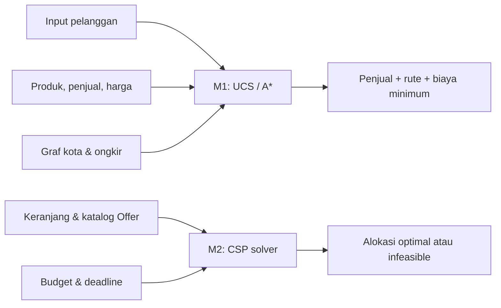

# SmartStore AI — Sistem Pencarian Harga Termurah E-Commerce


Proyek Akhir mata kuliah **10S3001 - Kecerdasan Buatan**, Program Studi
Sarjana Sistem Informasi, Institut Teknologi Del (Semester Gasal 2026/2027).

Tema besar: *Enterprise AI Assistant / Copilot* — mengintegrasikan
penalaran simbolik, machine learning, dan generative agentic AI untuk
solusi sistem informasi bisnis.

## Domain Bisnis
Purwarupa sistem cerdas untuk platform marketplace multi-penjual, yang
membantu pelanggan menemukan **kombinasi harga termurah** (harga produk +
ongkos kirim) saat membeli satu produk maupun berbelanja banyak produk
sekaligus dalam satu keranjang, dengan mempertimbangkan batasan bisnis
nyata (budget, tenggat pengiriman, gratis ongkir per penjual).

Lihat [`docs/problem_framing.md`](docs/problem_framing.md) (termasuk
formulasi formal ruang keadaan Milestone 1), [`docs/peas.md`](docs/peas.md),
dan [`docs/csp_formulation.md`](docs/csp_formulation.md) (formulasi formal
CSP Milestone 2) untuk detail lengkap. Laporan gabungan untuk kedua
milestone tersedia di [`docs/laporan_milestone1_2.md`](docs/laporan_milestone1_2.md).

> Catatan data: seluruh data penjual/harga pada Milestone 1-2 ini masih
> data dummy yang dirancang realistis. Data ini bisa diganti dengan data
> nyata (mis. hasil scraping marketplace) pada Milestone 3 — cukup
> dinormalisasi ke struktur `Offer` yang sama, tanpa mengubah logika
> algoritma search/CSP.

## Tim & Peran

| Nama | NIM | Peran |
|------|-----|-------|
| Dea Anggreany Hutapea | 12S24053 | AI Architect & Model Lead |
| Rospika Sarah Yosefin Siregar | 12S24008 | Data & Knowledge Engineer |
| Fredrick Laurensius Aritonang | 12S24001 | Integration & Interface Engineer / QA & Ethics Lead |

> Tim beranggotakan 3 orang — Fredrick merangkap peran Integration &
> Interface Engineer sekaligus QA, Evaluation & Ethics Lead.

**Kelompok:** Grup 14  
**Dosen pengampu:** Samuel Indra Gunawan Situmeang  
**Semester:** Gasal 2026/2027  
**Repositori:** [DeaHutapea/smartstore-ai](https://github.com/DeaHutapea/smartstore-ai)

## Struktur Repositori

```
.
├── data/
│   └── cart_catalog.json     # Katalog penjual (data simulasi) format JSON
├── docs/
│   ├── architecture.md       # Arsitektur 5-lapis + status per lapisan
│   ├── data_schema.md        # Skema data katalog
│   ├── etika_privasi.md      # Etika, privasi (UU PDP), bias, keamanan
│   ├── problem_framing.md    # Business problem framing + formulasi formal search
│   ├── peas.md               # Spesifikasi formal PEAS
│   ├── csp_formulation.md    # Pemodelan matematis formal CSP (Milestone 2)
│   └── laporan_milestone1_2.md # Draf laporan Tugas 1 & Tugas 2
├── src/
│   ├── search/
│   │   └── price_search.py   # M1: Baseline UCS & A* — harga total termurah
│   ├── csp/
│   │   └── cart_solver.py    # M2: CSP solver — optimasi keranjang multi-produk
│   └── knowledge/
│       └── catalog_loader.py # Loader + validasi katalog JSON
├── tests/
│   ├── test_price_search.py
│   ├── test_cart_solver.py
│   ├── test_cart_edge_cases.py   # Kasus ekstrem (boundary, keranjang kosong, dll.)
│   └── test_catalog_loader.py
├── LICENSE
├── pyproject.toml
└── .gitignore
```

## Arsitektur Milestone 1–2



Semua nilai biaya pada data contoh disimpan dalam **ribuan Rupiah**. Data
katalog yang tersedia saat ini adalah data simulasi di dalam kode, bukan
dataset marketplace eksternal.

## Status Milestone

### Milestone 1 (revisi) — Baseline Search
- [x] Problem framing & PEAS direvisi ke domain harga termurah
- [x] Baseline search UCS & A* — cari kombinasi penjual+ongkir termurah
      untuk satu produk (multi-source shortest path)
- [x] Unit test (pytest), termasuk verifikasi heuristik terhadap shortest
      path semua pasangan kota

### Milestone 2 — Business Constraint Solver (CSP)
- [x] Pemodelan CSP formal: Variables (produk di keranjang), Domain
      (penjual per produk), Constraints (unary: deadline; binary: selisih
      lama kirim antar produk; global: budget)
- [x] AC-3 (propagasi batasan biner) + node consistency (filter deadline)
- [x] Backtracking Search dengan MRV, LCV (jumlah opsi kompatibel
      terbanyak), forward checking, dan branch-and-bound
- [x] Analisis sensitivitas median 5 pengulangan: waktu dan node yang
      dikunjungi saat ukuran keranjang bertambah
- [x] Unit test termasuk kasus ekstrem (budget sangat kecil, deadline
      sangat ketat → infeasible) serta perbandingan dengan brute-force

> Submission ini menggabungkan revisi Milestone 1 dengan Milestone 2,
> sesuai arahan asisten dosen.

## Cara Menjalankan (Astral `uv`)

```bash
# Install dependensi & buat virtual environment
uv sync

# Jalankan demo baseline search (Milestone 1)
uv run python src/search/price_search.py

# Jalankan demo CSP solver (Milestone 2)
uv run python src/csp/cart_solver.py

# Jalankan seluruh test otomatis
uv run pytest -v
```

Laporan analisis hasil dan draf format penyerahan ada di
[`docs/laporan_milestone1_2.md`](docs/laporan_milestone1_2.md). Sebelum
dikumpulkan, ekspor bagian laporan ke PDF sesuai instruksi tugas dan
tambahkan tautan tag GitHub setelah tag `v0.2-milestone2` benar-benar dibuat.
Repositori sudah berisi lisensi MIT; pastikan pilihan lisensi tersebut
disetujui seluruh anggota.

Kalau belum punya `uv`, install dulu: https://docs.astral.sh/uv/getting-started/installation/

### Troubleshooting `uv sync`

| Masalah | Solusi |
|---|---|
| `uv: command not found` / `'uv' is not recognized` | `uv` belum terpasang atau belum masuk `PATH`. Install, lalu tutup dan buka ulang terminal. |
| Gagal karena versi Python | Proyek butuh Python `>=3.11`. Jalankan `uv python install 3.12` lalu `uv sync`. |
| Gagal mengunduh paket (timeout) | Cek koneksi atau proxy, lalu `uv cache clean` dan `uv sync` lagi. |
| Virtual environment rusak | Hapus `.venv` (PowerShell: `Remove-Item -Recurse -Force .venv`), lalu `uv sync`. |
| `ModuleNotFoundError: pytest` | Jalankan lewat `uv run pytest -v`, bukan `pytest` langsung. |
| `uv.lock` tidak sinkron | Setelah mengubah `pyproject.toml`: `uv lock`, `uv sync`, commit keduanya. |

## Roadmap Milestone Selanjutnya
- **Milestone 3 (W07):** Knowledge Base & Vector Search (ChromaDB, RAG) —
  di sinilah data dummy dapat digantikan data nyata yang dinormalisasi
- **Milestone 4 (W11):** Enterprise AI Agent Pipeline (ReAct + Gemini + FastMCP)
- **Milestone 5 (W13):** Dashboard interaktif Gradio
- **UAS (W15-16):** Showcase, live demo, laporan teknis final
