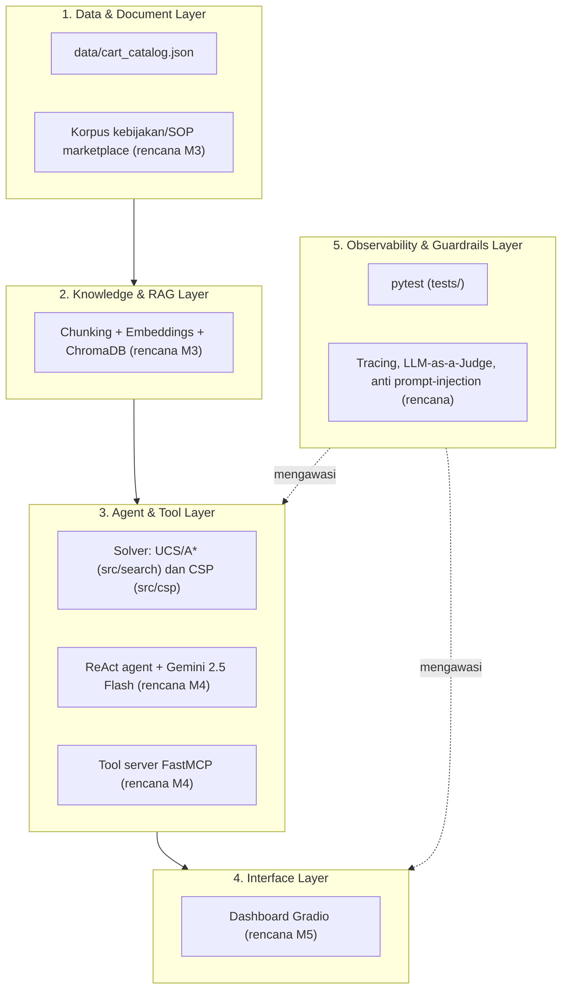

# Arsitektur Sistem 5-Lapis — SmartStore AI

Dokumen desain arsitektur (AI Architect & Model Lead). Mengikuti arsitektur
5-lapis pada panduan proyek akhir. Bagian bertanda **(rencana)** belum
diimplementasikan; status per lapisan ada di tabel bawah.

## Status per lapisan
| Lapisan | Status saat ini (Milestone 1-2) | Rencana |
|---|---|---|
| 1. Data & Document | Katalog dummy masih tertanam di kode; pemindahan ke JSON dan loader tervalidasi menjadi kontribusi tahap Rospika berikutnya | Korpus dokumen bisnis, OCR bila diperlukan |
| 2. Knowledge & RAG | Belum ada | Word-aware chunking, embeddings, ChromaDB (M3) |
| 3. Agent & Tool | Solver UCS/A* dan CSP (AC-3, MRV, LCV) sebagai fungsi Python | Dibungkus sebagai tool FastMCP; siklus ReAct dengan batas iterasi (M4) |
| 4. Interface | CLI demo | Gradio dengan streaming dan panel sitasi (M5) |
| 5. Observability & Guardrails | Unit test pytest | Log terstruktur, evaluasi LLM-as-a-Judge, delimiter `<<<USER_INPUT>>>` |

## Keputusan desain
- **Solver tetap deterministik dan terpisah dari LLM.** Agen memanggil solver
  sebagai *tool*, sehingga angka biaya selalu berasal dari algoritma yang
  terverifikasi (dibandingkan dengan brute-force di test), bukan dari
  perkiraan model bahasa.
- **Data dipisah dari logika** (`data/` + `knowledge/catalog_loader.py`)
  pada tahap berikutnya, agar pergantian ke data nyata tidak mengubah kode
  solver.
- **Gagal secara eksplisit:** solver mengembalikan `infeasible` beserta alasan,
  bukan solusi yang melanggar batasan.
